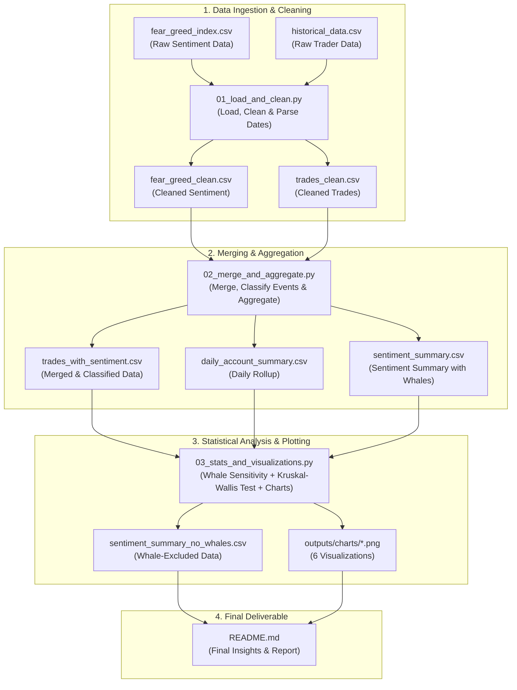
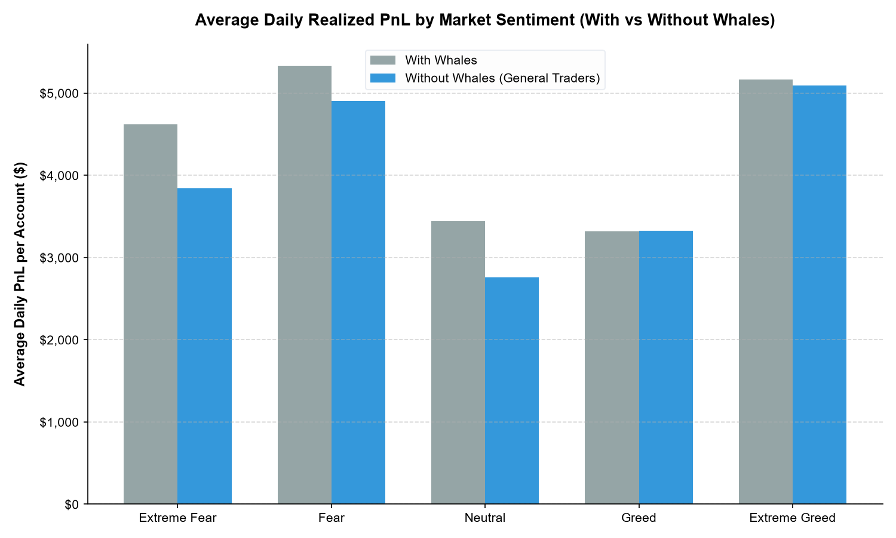
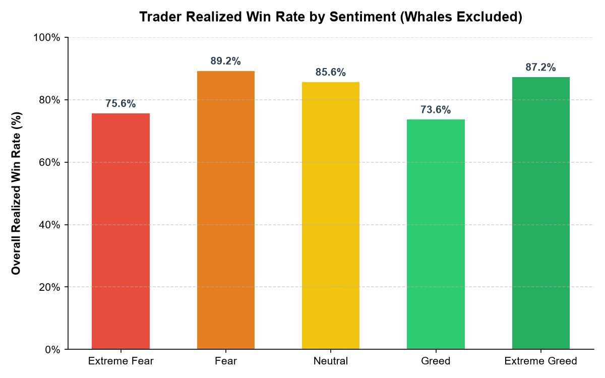
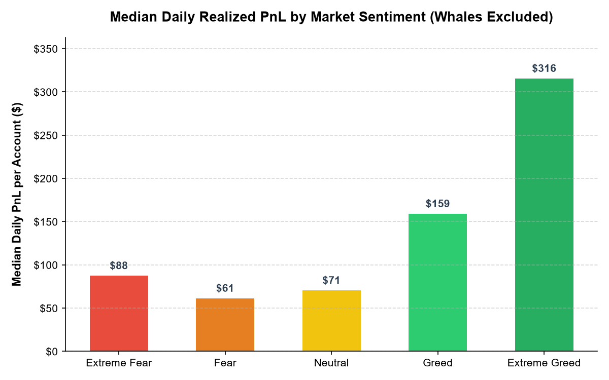
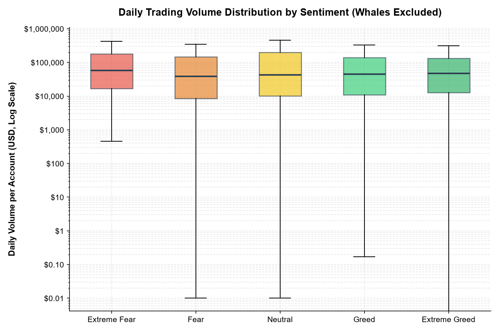
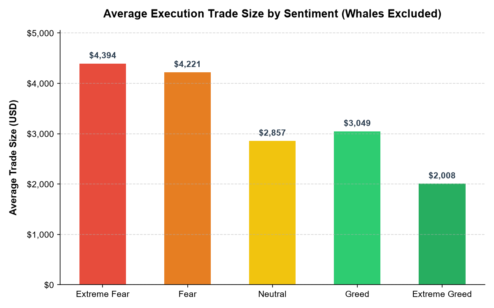
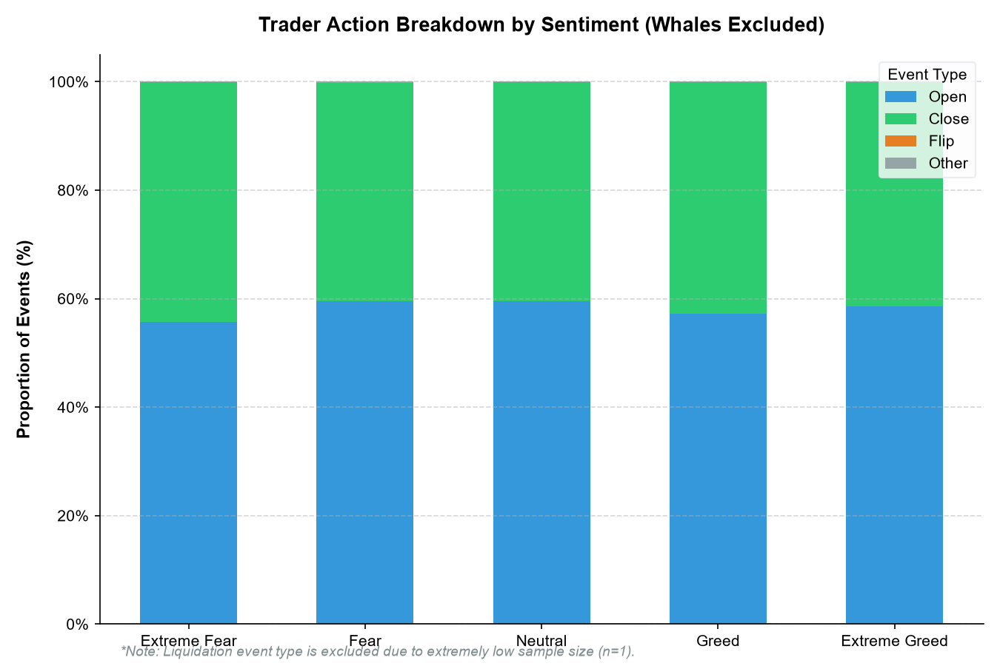

# Market Sentiment & Trader Performance Analysis on Hyperliquid

This repository contains an exploratory data analysis of the relationship between Bitcoin market sentiment (as measured by the Fear & Greed Index) and decentralized trading performance on Hyperliquid. 

Using 211k+ execution fills across a 732-day overlapping window, we analyze realized profit/loss (PnL), win rates, and trader behaviors to extract actionable, data-backed insights.

---

## Data Pipeline Architecture

The flowchart below visualizes the execution pipeline built for this analysis:



---

## Datasets

The analysis leverages two real-world datasets:
1. **`fear_greed_index.csv`**: Contains daily sentiment data spanning `2018-02-01` to `2025-05-02`, classified into *Extreme Fear*, *Fear*, *Neutral*, *Greed*, and *Extreme Greed*.
2. **`historical_data.csv`**: Real execution-level fill data on Hyperliquid spanning `2023-05-01` to `2025-05-01`, containing 211,224 trade-level rows across various accounts and coins.
3. **Temporal Overlap**: The datasets overlap perfectly for **732 days** (2 full years) between `2023-05-01` and `2025-05-01`.

---

## Methodology

### 1. Fill-Level vs. Close-Level Realization
The raw trader data represents fill-level executions (incremental fills) rather than trade-level orders. realizing Closed PnL only occurs when a trade is closed, liquidating, or converting dust. Consequently, **50.57%** (106,816 rows) of the raw execution rows have a `Closed PnL` of exactly 0. To calculate win rates and PnL performance accurately without diluting the signal, our analysis isolates the **49.43%** (104,408 rows) of rows with non-zero realized PnL.

### 2. Action Event-Type Classification
Using the `Direction` column, we categorized each trade execution into four main operational action types:
* **`open`** (*59.77%*): Opening a long or short position (e.g., `'Open Long'`, `'Open Short'`, `'Buy'`, or `'Sell'` when not closing).
* **`close`** (*40.10%*): Closing or reducing a position (e.g., `'Close Long'`, `'Close Short'`).
* **`flip`** (*0.06%*): Direct transition between positions (e.g., `'Long > Short'`, `'Short > Long'`).
* **`other`** (*0.07%*): Structural actions (e.g., `'Auto-Deleveraging'`, `'Spot Dust Conversion'`, `'Settlement'`).
* **`liquidation`** (*<0.01%*): Excluded from risk summaries due to sparse representation (only $n=1$ liquidation event exists in the dataset).

### 3. Account-Day Rollup Aggregation
To prevent trade-level frequency biases (e.g., a single order splitting into dozens of microsecond fills), we roll up the metrics to an **account-day** level. For each unique account on each day, we sum the realized PnL and trade sizes, and compute a daily win rate (percentage of `close` events realizing a profit > 0, ignoring days with zero closes). This yields 2,340 distinct performance observations.

### 4. Whale Sensitivity Check
Five hyper-active accounts represented **$801,170,266.42** in aggregate volume, representing a substantial portion of the dataset. The largest account alone generated **$420,876,556.36** in volume. To ensure the findings represent general trader behavior rather than institutional outliers, we computed all metrics both *with* and *without* these 5 whales.

### 5. Statistical Significance Verification
Because trader PnL distributions are highly skewed with extreme tails, a standard parametric t-test is inappropriate. We utilize a non-parametric **Kruskal-Wallis H-test** on daily realized account-day PnL across all five sentiment classes. 

---

## Key Insights

* **Sentiment-PnL Relationship is Statistically Significant**: 
  The Kruskal-Wallis test results are highly significant:
  * *With Whales*: $H$-statistic = `15.7322`, $p$-value = `0.0034`
  * *Without Whales*: $H$-statistic = `20.8168`, $p$-value = `0.00034`
  The p-value *decreased* once whales were excluded, indicating that whale outliers acted as statistical noise and that the underlying sentiment-PnL relationship is highly robust.
* **Ambiguous "Greed" is the Worst-Performing Regime**:
  General traders in the moderate **Greed** classification suffer the lowest performance:
  * **Win Rate**: `73.62%` (the lowest overall)
  * **Average Daily PnL**: `$3,322.66` (underperforming both Fear and Extreme Greed)
  This indicates that traders struggle to capture clean returns when the market is moderately bullish but lacks extreme momentum.
* **Trader Conviction peaks at Emotional Extremes**:
  Traders demonstrate significantly better performance at market extremes. During **Fear** conditions, traders achieve their highest win rate of **`89.22%`** (avg. daily PnL of `$4,904.46`). During **Extreme Greed**, they achieve a win rate of **`87.21%`** (avg. daily PnL of `$5,089.72`).
* **Extreme Greed Offers the Best Risk-Adjusted Profile**:
  Contrary to the standard advice to "be fearful when others are greedy", general traders on Hyperliquid perform exceptionally well during **Extreme Greed** tops:
  * **Median Daily PnL**: `$315.68` (highest of all sentiment classes)
  * **Average Trade Size**: `$3,112.25` (the lowest of all sentiment classes)
  This indicates that successful traders scale down their trade sizes during extreme mania, maintaining discipline and picking high-probability closing setups.

---

## Visualizations

### 1. Average Daily Realized PnL

*This grouped bar chart highlights how the presence of whale accounts skews average PnL. Once whales are removed, the highest average daily PnL occurs during Extreme Greed ($5,089.72) and Fear ($4,904.46), with moderate Greed underperforming ($3,322.66).*

### 2. Win Rate by Sentiment

*Displays the overall trader realized win rate (whale-excluded). Win rates drop to a low of 73.62% during Greed, while spiking to 89.22% and 87.21% in Fear and Extreme Greed respectively.*

### 3. Median Daily Realized PnL

*Unlike averages, median PnL is robust to extreme outliers. Extreme Greed leads with a median daily PnL of $315.68, which is nearly double that of normal Greed ($159.20) and five times that of Fear ($61.43).*

### 4. Daily Trading Volume Distribution

*A box plot showing the spread of daily trading volumes on a log scale (whales excluded). Traders maintain consistent volume bands, but the widest variance in activity spreads occurs during normal Fear and Greed regimes.*

### 5. Average Transaction Trade Size

*Traders execute significantly smaller trade sizes ($3,112.25) during Extreme Greed compared to Fear ($7,816.11) and Greed ($5,736.88), illustrating that risk-mitigating position sizing scales down during manic tops.*

### 6. Event Action Breakdown

*A stacked bar chart showing the composition of execution event types. Open and close proportions remain relatively constant, but the highest proportion of close events occurs during Fear, reflecting defensive trade realizations.*

---

## Actionable Strategy Recommendations

1. **Reduce Exposure in Moderate "Greed" Regimes**:
   Discretionary traders should scale down activity or raise their entry thresholds during moderate "Greed" conditions. This regime yields the lowest win rates (73.62%) and mediocre median daily profits, representing a low-probability trading environment.
2. **De-Risk Position Sizes as Euphoria Peaks**:
   The highest performance efficiency (high median PnL, high win rate) in Extreme Greed is coupled with the smallest average trade size ($3,112.25). Traders should scale down their average position sizing during manic bull runs to manage tail risk while capitalizing on late-stage trend runs.
3. **Capitalize on Extreme Fear Capitulations**:
   Fear and Extreme Fear represent high-probability win rate environments (89.22% and 75.60% respectively). Traders should look for mean-reversion buying opportunities during extreme panic when execution win rates are historically high.

---

## Limitations

* **Sparse Liquidation Data**: Only 1 liquidation execution was logged in the trade dataset, preventing statistical modeling of liquidation risks across sentiment classes.
* **No Leverage/Margin Visibility**: The lack of margin columns limits the ability to calculate return-on-collateral or leverage-adjusted risk metrics.
* **Correlation vs. Causation**: Market sentiment and trader performance may both be driven by exogenous factors like volatility or funding rates rather than sentiment directly causing trader actions.
* **General Retail Bias**: The findings represent general retail/small-size traders on Hyperliquid, as institutional whales were explicitly excluded from the headline metrics.

---

## How to Run

### Prerequisite Setup
Ensure Python 3.9+ is installed. Clone the repository and install dependencies:
```bash
pip install -r requirements.txt
```

### Execution Pipeline
Run the scripts in order to reproduce the processed data, statistical tests, and charts:

1. **Load and Clean Data**:
   ```bash
   python src/01_load_and_clean.py
   ```
   *Loads raw data, performs date parsing, and exports intermediate datasets.*

2. **Merge and Aggregate**:
   ```bash
   python src/02_merge_and_aggregate.py
   ```
   *Left-joins index values and computes account-day and sentiment summaries.*

3. **Statistics and Plotting**:
   ```bash
   python src/03_stats_and_visualizations.py
   ```
   *Excludes whales, computes Kruskal-Wallis significance, and generates all charts.*

---

## Project Structure

```
├── data/
│   ├── fear_greed_index.csv               # Raw daily sentiment index
│   ├── historical_data.csv                # Raw trader execution fills
│   └── processed/
│       ├── fear_greed_clean.csv           # Cleaned daily sentiment index
│       ├── trades_clean.csv               # Cleaned trader data with standardized dates
│       ├── trades_with_sentiment.csv      # Merged dataset containing event classifications
│       ├── daily_account_summary.csv      # Daily account-level rollup summary
│       ├── sentiment_summary.csv          # Sentiment aggregation with whales included
│       └── sentiment_summary_no_whales.csv# Sentiment aggregation with whales excluded
├── src/
│   ├── 01_load_and_clean.py               # Data ingestion and date cleaning script
│   ├── 02_merge_and_aggregate.py          # Data merging and rollup script
│   └── 03_stats_and_visualizations.py     # Whale sensitivity analysis and plotting script
├── outputs/
│   └── charts/                            # Generated PNG visualizations
├── README.md                              # Professional final report
└── requirements.txt                       # Project python packages
```
